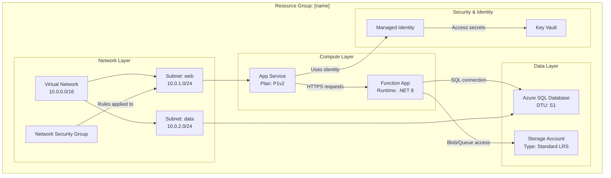

# Example Architecture Diagram

This example shows a typical Azure resource group with resources organized into logical layers.

## Sample Mermaid Diagram

## Diagram Features

This example demonstrates:

- **Layered organization**: Resources grouped by function (Network, Compute, Data, Security)
- **Detailed node labels**: Each resource includes configuration details (SKUs, tiers, settings)
- **Descriptive connections**: Relationships are labeled to show data flow and dependencies
- **Subgraphs**: Logical grouping makes the architecture easy to understand
- **Resource variety**: Shows common Azure services and their interconnections
